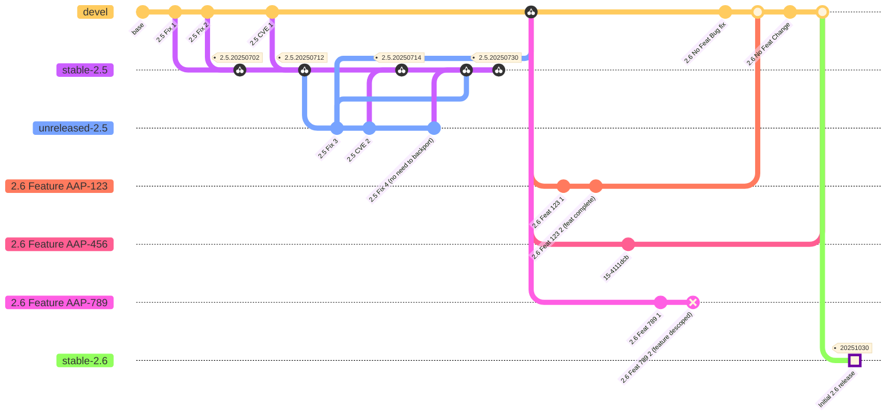

[](https://codecov-codecov.apps.rosa.konflux-qe.zmr9.p3.openshiftapps.com/gh/ansible-automation-platform/aap-gateway/tree/stable-2.6)
[](https://sonarcloud.io/summary/new_code?id=ansible-automation-platform_aap-gateway&branch=stable-2.6)
[](https://sonarcloud.io/summary/overall?id=ansible-automation-platform_aap-gateway&branch=stable-2.6)
[](https://sonarcloud.io/project/issues?impactSoftwareQualities=SECURITY&issueStatuses=OPEN%2CCONFIRMED&id=ansible-automation-platform_aap-gateway&branch=stable-2.6)
[](https://sonarcloud.io/component_measures?metric=security_rating&id=ansible-automation-platform_aap-gateway&branch=stable-2.6)
[](https://sonarcloud.io/component_measures?metric=bugs&view=list&id=ansible-automation-platform_aap-gateway&branch=stable-2.6)
[](https://sonarcloud.io/component_measures?metric=new_code_smells&view=list&id=ansible-automation-platform_aap-gateway&branch=stable-2.6)
[](https://sonarcloud.io/component_measures?id=ansible-automation-platform_aap-gateway&metric=sqale_rating&view=list&branch=stable-2.6)

# AAP Services Gateway

The goal for a platform wide gateway is to provide a single entry point that sits in front of all the services within AAP. Right now there are a couple issues with how authentication is achieved within the platform:

* [JIRA Epic](https://issues.redhat.com/browse/ANSTRAT-37)
* [JIRA Plan View](https://issues.redhat.com/secure/PortfolioReportView.jspa?r=Jivql#plan/backlog)
* [POC Code](https://github.com/ansible/aap-gateway-poc)
* [Google Drive](https://drive.google.com/drive/u/0/folders/18HxXa1K7Joeicnx43RCVVlhWHDnXf-Cx)
* [Miro Arch Diagrams](https://miro.com/app/board/uXjVM3achZw=/)
* [Miro Auth Brainstorming](https://miro.com/app/board/uXjVM2exfpo=/)


Gateway is currently in design phase, more information will be available later.

This repo is internal only at this time.

[](https://opensource.org/licenses/Apache-2.0)

## Starting Gateway

### Install prerequisites

Please have the following prerequisites already installed on your development machine:
  * docker
  * make
  * openssl
  * gcc
  * ansible-core

#### Fedora dnf packages
Dependencies can be provided by the following packages:
```
sudo dnf install libxml2-devel xmlsec1-devel xmlsec1-openssl-devel libtool-ltdl-devel python-devel openldap-devel xmlsec1
```

### Install python dependencies

* Make sure to use Python 3.12
* Create a python virtual environment: `python3 -m venv <location>`
* Activate the virtual environment: `source <location>/bin/activate`
* Install the tools for development: `pip install -r requirements/requirements_dev.txt`
* Optionally clone `django-ansible-base` if you are going to be making changes to it. If you clone it, it must live directly inside your `aap-gateway` directory, and be called `django-ansible-base`. If you skip this step, the latest git version of `django-ansible-base` will be built into your development image.

### Proxy Configuration

This is an optional step.  
Configure your proxy routes to the local gateway, controller, hub and eda instances.

  * Generate a tools/generated/proxy.yml file.
  * * Run command `make tools/generated/proxy.yml`.
  * * File is based on sample configuration [tools/ansible/roles/proxy-config/templates/proxy.yml.j2](tools/ansible/roles/proxy-config/templates/proxy.yml.j2) 
  * Modify endpoints in tools/generated/proxy.yml according to comments

This will be used to create the envoy configuration from [tools/configs/envoy.yml](tools/configs/envoy.yml).

### Run the environment 

* Log into quay.io: `docker login quay.io`
* Start up your environment: `make docker-compose`
  * Alternatively, you can split it into standalone steps:
    * `make docker-compose-basic` - Build & run the gateway containers
    * `make register-services` - Configure the proxy 
    * `make plumb` - Plumb the side cars (below)

This will:
- `make docker-compose-basic`:
  - build an `admin` user with random password (see value for `gateway_admin_password` in `container-startup.yml`)
    - You can force your own password by setting the `ADMIN_PASSWORD` environment variable before running `make docker-compose`.
- `make register-services`:
  - create http ports, services and routes you have defined in your `proxy.yml` file
- `make plumb`: 
  - plumb (connects) containers enabled in `container-startup.yml` (mode detailed in chapters below):
    - `keycloak_enabled: True`  (auth)
    - `ldap_enabled: True` (auth)
    - `tacacs_enabled: True` (auth)
    - `splunk_enabled: true` (logging)

## Starting other AAP services

See [development doc](docs/development.md)

## Side cars

There are additional services available to be started alongside gateway to enable development. We call these side car containers. When you run an initial `make docker-compose` a file called `container-startup.yml` will be created at the root of your project. If you haven't run `make docker-compose` yet and want to generate the file you can run `make container-startup.yml".

At the beginning of you file you will see the following options:
```
gateway_host: https://localhost:8000
gateway_admin_username: admin
gateway_admin_password: admin
container_reference: 10.0.0.71
```

gateway_host, username and password tell us how to connect to your gateway instance once its running. This is used to configure things like settings inside your gateway instance to connect to to the side containers. If you change the admin password, please update it in this file.

`container_reference` is used for several of the authentication mechanisms. For example, SAML works by sending redirects between gateway and Keycloak through the browser. Because of this we have to tell both gateway and Keycloak how they will construct the redirect URLs. On the Keycloak side, this is done within the realm configuration and on the gateway side its done through the SAML settings. The container_reference variable needs to be how your browser will be able to talk to the running containers. Here are some examples of how to choose a proper container_reference.
* If you develop on a mac which runs a Fedora VM which has gateway running within that and the browser you use to access gateway runs on the mac. The the VM with the container has its own IP that is mapped to a name like `gateway.home.net`. In this scenario your "container_reference" could be either the IP of the VM or the gateway.home.net friendly name.
* If you are on a Fedora work station running gateway and also using a browser on your workstation you could use localhost, your work stations IP or hostname as the container_reference.

By default, all side cars are disabled. The next section of the file has lines which say which side containers to start. i.e.:
```
# ldap_enabled: True
```

These can be any valid true or false statements ansible can handle. A `true` value indicates that the container should be started and a `false` leaves the container disabled.

There are two times these variables are checked. First when we run `make docker-compose` an additional step to initialize any containers will be run. These steps vary per container type but all are idempotent so running them multiple times should not cause issues.

Secondly, we have a plumb playbook which will configure your gateway instance to use the containers. When running the plumb playbook this will only plumb for containers which are initialized.

In addition to this file, there is a file `tools/ansible/vars/container_config.yml` which has default information for the various services. These allow for further customization of the containers (such as default account credentials for services or exposed ports and image versions, etc).

In the following sections of this document we will discuss individual integrations and some of the extended variables which can be set in your container-startup.yml to override the defaults in `tools/ansible/vars/container_config.yml`

### SAML and OIDC Integration
Keycloak can be used as both a SAML and OIDC provider and can be used to test gateway social auth. This section describes how to build a reference Keycloak instance and plumb it with gateway for testing purposes.

_Note_: If you are using M1 Mac, refer to building [keycloak image for M1](./docs/keycloak_on_m1.md) documentation.

Once the containers come up a new port (8443 by default) should be exposed and the Keycloak interface should be running on that port. Connect to this through a url like `https://localhost:8443` to confirm that Keycloak has started. If you wanted to login and look at Keycloak itself you could select the "Administration console" link and log into the UI the username/password set in the container_config.yml file. For more information about Keycloak and links to their documentation see their project at https://github.com/keycloak/keycloak.

#### Additional Configuration
```
keycloak_exposed_port: 8443                               <- The exposed port on the machine running docker
keycloak_username: admin                                  <- Admin username and password
keycloak_password: admin
cert_subject: "/C=US/ST=NC/L=Durham/O=gateway/CN=devenv"  <- The CN for the self signed cert
oidc_reference:                                           <- See note below
```

Note: SAML works by sending redirects between gateway and Keycloak through the browser. Because of this we have to tell both gateway and Keycloak how they will construct the redirect URLs. On the Keycloak side, this is done within the realm configuration and on the gateway side its done through the SAML settings. The `container_reference` variable in the general section above is used for the configuration.

In addition, OIDC works similar but slightly differently. OIDC has browser redirection but OIDC will also communicate from the gateway docker instance to the Keycloak docker instance directly. Any hostnames you might have are likely not propagated down into the gateway container. So we need a method for both the browser and gateway container to talk to Keycloak. For this we will likely use your machines IP address. This can be passed in as a variable called `oidc_reference`. If unset this will default to container_reference which may be viable for some configurations.


#### Plumbing
The plumbing of Keycloak will:
* Backup and configure a SAML SP and OIDC authenticator in gateway. NOTE: the private key of any existing SAML or OIDC authenticators can not be backed up through the API, you need a DB backup to recover this.

Once the playbook is done running both SAML and OIDC should now be setup in your development environment. This realm has three users with the following username/passwords:
1. gateway_unpriv:unpriv123
2. gateway_admin:admin123
3. gateway_auditor:audit123

The first account is a normal user. The second account has the SAML attribute is_superuser set in Keycloak so will be a super user in gateway if logged in through SAML. The third account has the SAML is_system_auditor attribute in Keycloak so it will be a system auditor in gateway if logged in through SAML. To log in with one of these Keycloak users go to the gateway login screen and <TBD>.

<TBD>
# Note: The OIDC adapter performs authentication only, not authorization. So any user created in gateway will not have any permissions on it at all.

If you Keycloak configuration is not working and you need to rerun the playbook to try a different `container_reference` or `oidc_reference` you can log into the Keycloak admin console on port 8443 and select the gateway realm in the upper left drop down. Then make sure you are on "Realm Settings" in the Configure menu option and click the trashcan next to gateway in the main page window pane. This will completely remove the gateway ream (which has both SAML and OIDC settings) enabling you to re-run the plumb playbook.

### OpenLDAP Integration

OpenLDAP is an LDAP provider that can be used to test gateway with LDAP integration.

Once the containers come up two new ports (389, 636 by default) should be exposed and the LDAP server should be running on those ports. The first port (389) is non-SSL and the second port (636) is SSL enabled.

#### Additional Configuration
```
ldap_exposed_ldap_port: 389             <- The ldap port to expose on the machine running docker
ldap_exposed_ldaps_port: 636            <- The ldaps port to expose on the machine running docker
ldap_image_version: 2                   <- The version of the OpenLDAP container to run
ldap_admin_username: admin              <- Username and password
ldap_admin_password: admin
ldap_public_key_file_name: 'ldap.cert'  <- Name of the public cert file in tools/generated/ldap
ldap_private_key_file_name: 'ldap.key'  <- Name of the private key file in tools/generated/ldap
```

Note: LDAP will be communicated to from within the gateway container. Because of this, we have to tell gateway how to route traffic to the LDAP container through the `Server URI` authenticator configuration. This setting is constructed via the `container_reference` variable in the general section above.

#### Plumbing
The plumb playbook for OpenLDAP will:

* Backup and configure an LDAP authenticator in gateway. NOTE: this will back up your existing settings but the password fields can not be backed up through the API, you need a DB backup to recover this.

Note: The default configuration will utilize the non-tls connection. If you want to use the tls configuration you will need to work through TLS negotiation issues because the LDAP server is using a self signed certificate.

Once the playbook is done running LDAP should now be setup in your development environment. This realm has four users with the following username/passwords:
1. ldap_unpriv:unpriv123
2. ldap_admin:admin123
3. ldap_auditor:audit123
4. ldap_org_admin:orgadmin123

The first account is a normal user. The second account will be a super user in gateway. The third account will be a system auditor in gateway. The fourth account is an org admin. All users belong to an org called "LDAP Organization". To log in with one of these users go to the gateway login screen enter the username/password.

Additionally, there is also a second authenticator called `Dev LDAP Container Union` that is disabled by default. This authenticator exposes both the ou `user` as well as `other_users` and comes with the users above as well as the same users with the prefix `other_` i.e. `other_lpda_unpriv`. All users have the same passwords as above for their corresponding account.

### tacacs+ Integration

tacacs+ is an networking protocol that provides external authentication which can be used with gateway. This section describes how to build a reference tacacs+ instance and plumb it with your gateway for testing purposes.

Once the containers come up a new port (49) should be exposed and the tacacs+ server should be running on that port.

#### Additional Configuration
```
tacacs_container_version: latest <- Container version
```
You will need to make a few changes to `container-startup.yml` to enable tacacs+.If you are running a Docker instance you will need to  change the `container_reference:` to either your workstation IP address or `host.docker.internal`. This will vary if you are not using Docker. 

To enable the sidecar, you will also need to uncomment `tacacs_enabled: True`. Once the containers come up you will have access to the following user:
1. iosadmin: cisco

This is the admin user for TACACS+.For additional configuration and user information, please visit https://hub.docker.com/r/dchidell/docker-tacacs.

#### Plumbing

The plumb playbook will:
* Backup and configure a tacacsplus authenticator in gateway. NOTE: this will back up your existing settings but the password fields can not be backed up through the API, you need a DB backup to recover this.

Once the playbook is done running tacacs+ should now be setup in your development environment. This server has the accounts listed on https://hub.docker.com/r/dchidell/docker-tacacs

# Branching Strategy

> NOTE: This will not be used for the `2.6` release. We were blocked by the lack of test pipelines for custom branches. We will work with the PDE team to add support for this for the `2.7` and future ones.

We currently have 2 branches in aap-gateway:
* `devel` (our development branch)
* `stable-2.5` (our 2.5 release branch)

This has been acceptable since we only needed to support and maintain one version of gateway. However, since we are now moving onto building 2.6 we need to expand our branching strategy. Some of our lessons learned from 2.5 include:
* Causing ourselves backporting issues from having features partially merged
* Having to decide to reorder stable-2.5 or ship unplanned fixes to get a CVE out

Based on these we are going to implement the following branching strategy in the AAP gateway repo:


This branching strategy introduces several types of branches, each serving a specific purpose:

## Core Branches
*devel* - The main development branch where all new features and bug fixes are initially developed and merged
*stable-2.x* - Long-lived release branches (e.g., stable-2.5, stable-2.6) that contain only production-ready code for each major version
*unreleased-2.5* - Staging branches for 2.5 backported fixes that haven't been released yet

## Feature Branches
*2.x Feature AAP-XXX* - Shorter-lived branches for developing individual features, named after their corresponding JIRA tickets
Features are developed in isolation and merged back to devel when complete.
Features can be descoped if needed before release and their code will not be introduced into devel.

## Workflow Patterns
### Bug Fixes and Security Patches
*Development*: All 2.6 fixes are initially developed on devel. All 2.5 fixes are initially developer on unreleased-2.5.
*Backporting*: Important fixes are cherry-picked to relevant stable-2.x branches
*Release*: Tagged releases are created from stable-2.x branches with appropriate version numbers

### Feature Development
*Branch Creation*: Feature branches are created from devel for each new feature
*Development*: Features are developed in isolation on their respective branches
*Integration*: Completed features (including ATF test completion) are merged back to devel
*Release Preparation*: When ready for the initial release, a new stable-2.6 branch will be created from devel

## Benefits of This Strategy
*Isolated Development*: Features can be developed independently without affecting other work
*Flexible Backporting*: Critical fixes can be selectively backported to supported versions
*Release Control*: Each release branch maintains stability while allowing continued development
*CVE Management*: Security fixes can be rapidly deployed without waiting for feature completion
*Feature Flexibility*: Features can be easily descoped if they're not ready for release

This strategy addresses the previous challenges by providing clear separation between feature development and maintenance work, while enabling flexible release management and easier backporting processes.
